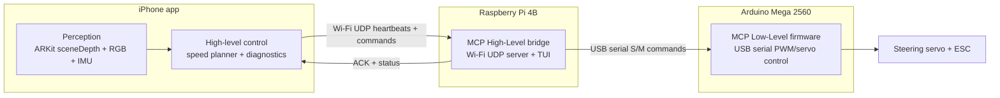

# metalbot


`metalbot` is an iPhone-first autonomous RC car project.

The name comes from Apple Metal: the app will rely on high-performance iPhone GPU/compute paths for perception over time.

The iPhone runs perception, estimation, and high-level control. Raspberry Pi 4B and Arduino act as MCP (motor/control processor) for low-level actuation and watchdog behavior.

## MVP1 Architecture



## Product Direction

1. **MVP1 (active): LiDAR-only closed loop**
   - LiDAR raw point-cloud capture from ARKit `sceneDepth`
   - RGB + point-cloud debug visualization (portrait top/bottom, landscape left/right)
   - IMU-first velocity estimation
   - speed planner + feedback control (reach target speed, then keep it)
   - straight driving by yaw-rate hold
   - planner-triggered stop when obstacle points block future path
   - iPhone to Raspberry Pi 4B command bridge over Wi-Fi UDP
   - Raspberry Pi to Arduino USB serial bridge for PWM/servo control
2. **MVP2 (parallel): RGB to mono depth prototype**
   - camera stream + Core ML depth inference on iPhone
3. **MVP3 (future): sparse LiDAR + RGB depth completion**
   - fuse sparse LiDAR and monocular depth (candidate direction includes MetricAnything-style approaches)

## Hardware and Constraints

- iPhone 13 Pro / iPhone 13 Pro Max
- RC chassis with steering and throttle actuation
- Raspberry Pi 4B + Arduino MCP: Wi-Fi UDP for iPhone<->Pi, USB serial for Pi<->Arduino
- Flat indoor floor for MVP1
- Vehicle speed target range (initial): `0.1` to `2.0` m/s

## Current MVP1 Status

- iOS app target (`metalbot`) is deployable from CLI and renders LiDAR point clouds plus RGB debug views.
- LiDAR runtime checks and camera permission flow are implemented.
- Raw point cloud capture is implemented (ARKit `sceneDepth` back-projection).
- Wi-Fi UDP MCP bridge and iOS MCP Diagnostics are implemented.
- Raspberry Pi USB serial forwarding to the Arduino is implemented with boot sync, reconnect, and ACK logging.
- App icon pipeline is working through `Assets.xcassets`.
- Remaining MVP1 work: IMU-first velocity estimation, planner/control loop, and obstacle-stop logic.

## Repository Docs

- `.ai-context/plan.md`: high-level plan with invariants, architecture, and transport/watchdog boundaries
- `.ai-context/task.md`: hierarchical task backlog by MVP
- `.ai-context/walkthrough.md`: implementation-time development log
- `.ai-context/coordinate-systems.md`: camera/world/pixel coordinate definitions and math
- `.ai-context/achievements.md`: task achievement index and evidence links
- `metalbot-ios/README.md`: iOS app setup, signing recovery, and deploy instructions
- `metalbot-mcp/README.md`: Raspberry Pi bridge, UDP heartbeat, serial forwarding, and TUI dashboard
- `firmware/metalbot-arduino/README.md`: Arduino PWM/servo firmware and deployment notes
- `assets/`: project artifacts (achievement screenshots and design sources)

## Key APIs and Sensors

- LiDAR + RGB: ARKit `ARWorldTrackingConfiguration` with `.sceneDepth`.
- Depth/confidence: `ARFrame.sceneDepth.depthMap` + `ARFrame.sceneDepth.confidenceMap`.
- Camera image: `ARFrame.capturedImage`.
- IMU: Core Motion (`CMDeviceMotion` for fused gyro + accelerometer + optional magnetometer).
- GPU rendering: Metal (`MTKView`) point rendering for real-time point cloud visualization.

## Build and Deploy

Use Xcode once for signing/capabilities, then iterate from CLI if preferred.

- preferred debug loop: `cd metalbot-ios && ./build.sh deploy`
- preferred release loop: `cd metalbot-ios && ./build.sh --release deploy`
- build: `xcodebuild`
- install/launch: `xcrun devicectl` (Xcode 15+)

### Build Profiles

- `Debug`:
  - `SWIFT_OPTIMIZATION_LEVEL = -Onone`
  - `SWIFT_COMPILATION_MODE = singlefile`
  - best for iteration and debugging
- `Release`:
  - `SWIFT_OPTIMIZATION_LEVEL = -O`
  - `SWIFT_COMPILATION_MODE = wholemodule`
  - best for on-device performance measurement and demos

For this project, `Release` is expected to run faster because depth back-projection and frame processing loops are CPU-heavy and benefit from compiler optimization.

```bash
# 1) List connected devices
xcrun devicectl list devices

# 2) Move into iOS app workspace
cd metalbot-ios

# 3) Debug: build + install + launch
./build.sh deploy

# 4) Release: optimized build + install + launch
./build.sh --release deploy

# 5) Manual build app for iOS device (Debug)
xcodebuild \
  -project metalbot.xcodeproj \
  -scheme metalbot \
  -configuration Debug \
  -destination "generic/platform=iOS" \
  -derivedDataPath .build/DerivedData \
  build

# 6) Manual build app for iOS device (Release)
xcodebuild \
  -project metalbot.xcodeproj \
  -scheme metalbot \
  -configuration Release \
  -destination "generic/platform=iOS" \
  -derivedDataPath .build/DerivedData \
  build

# 7) Install built app bundle
xcrun devicectl device install app \
  --device <DEVICE_UDID> \
  .build/DerivedData/Build/Products/<Debug-or-Release>-iphoneos/metalbot.app

# 8) Launch app
xcrun devicectl device process launch \
  --device <DEVICE_UDID> \
  com.metalbot.app
```
