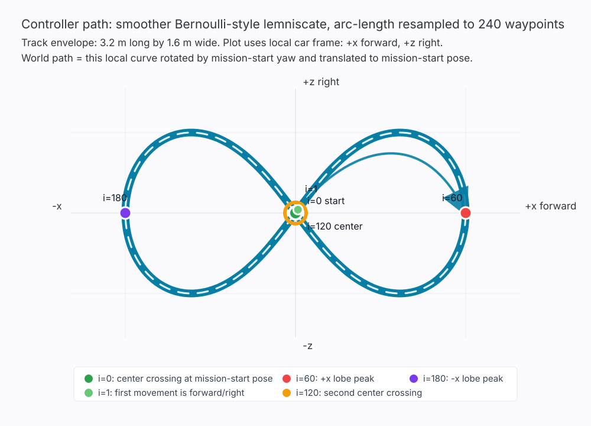

# Figure-Eight Basement Control - Revised Design

**Status:** Implemented waypoint-controller baseline for review
**Date:** 2026-06-10
**Branch/worktree:** `control-figure-eight-design` at `.worktrees/control-figure-eight-design`
**Technical note:** `docs/superpowers/specs/2026-06-10-figure-eight-path-following-technical.md`
**Trajectory plot:** `docs/superpowers/specs/2026-06-10-figure-eight-trajectory-plot.svg`

## 1. Goal

Make OpenOtter follow a repeatable figure-eight path indoors from a Telegram
or iOS agent command. This milestone intentionally starts with a waypoint
proportional controller, not pure pursuit or MPC.

The target behavior is:

- `/figure8` starts a closed figure-eight mission from the car's current pose.
- The first target segment enters the first lobe with bounded steering, not
  hard-left or hard-right.
- Steering sign matches the firmware PWM convention.
- The car keeps looping until the operator sends `/stop`.
- The map overlay shows the active planned waypoints.
- Firmware remains the deterministic actuator and safety layer.

## 2. Field Failure Review

Observed behavior:

- front wheels turned left,
- the car moved slowly for a while,
- then it stopped.

Root causes in the first implementation:

1. **Steering sign was inverted.** Firmware and `PwmMapping` define negative
   steering as left and positive steering as right, but `WaypointPlanner`
   produced negative steering for a target on robot-right.
2. **Figure-eight waypoints were not anchored to the current pose.** The
   command built a small path around ARKit world `(0, 0)` instead of the car's
   pose when the mission began.
3. **The path was too small and finite.** A `0.8 m x 0.5 m` one-lap waypoint
   list can be consumed quickly, after which the planner correctly emits
   neutral. From the operator seat, that looks like the mission died.
4. **The map overlay used stale state.** `SelfDrivingViewModel.waypoints` was
   never populated, so the UI was not showing the actual active path.

Second field review after the waypoint baseline:

- The requested trajectory is a horizontal infinity-track figure eight, not a
  rotated/diagonal center-crossing convenience curve.
- The car's map trace collapsed into one lobe, which is consistent with a
  waypoint follower chasing a missed waypoint instead of advancing along the
  closed path.
- The front wheel servo made end-stop chatter, so steering authority must be
  capped below full travel until the mechanical range is calibrated.

Third field review after raising mission speed:

- `0.6` normalized throttle was too fast for the basement test.
- The car still looked like it did not turn enough to follow the figure eight.
- The controller's computed initial steering was only about `0.23`, which is
  mathematically nonzero but may be too weak to overcome steering deadband,
  carpet load, or linkage friction.
- The earlier `0.25 m` waypoint acceptance radius was also too loose for the
  roughly `5 cm` waypoint spacing, so the controller could skip the first
  shaping waypoints at the center crossing.

The fix is not to jump to a more advanced controller yet. The fix is to make
the simple controller coherent and testable.

## 3. Coordinate And PWM Invariants

OpenOtter planner code uses the ARKit ground plane as:

```text
+x = robot forward
+z = robot right
yaw 0 = facing +x
```

Yaw rotates the robot's local axes into world coordinates:

```text
forward_world = ( cos(yaw), -sin(yaw))
right_world   = ( sin(yaw),  cos(yaw))
```

Firmware PWM convention is:

```text
steering -1.0 -> 1000 us -> full left
steering  0.0 -> 1500 us -> centered
steering +1.0 -> 2000 us -> full right
```

Therefore a target at robot-right must produce **positive** steering. This is
locked by `WaypointPlannerTests`.

## 4. Controller Strategy

The baseline controller is a waypoint proportional heading controller:

1. Keep an ordered list of waypoints.
2. If the current waypoint is inside its acceptance radius, advance to the
   next waypoint.
3. Compute the desired heading from current pose to target waypoint:

```text
dx = target.x - pose.x
dz = target.z - pose.z
desired_yaw = atan2(-dz, dx)
heading_error = wrap_to_pi(desired_yaw - pose.yaw)
```

4. Convert heading error to steering:

```text
steering = clamp(-K * heading_error, -maxSteering, +maxSteering)
```

The minus sign matters because, in this coordinate convention, a target to the
right has negative heading error, but the actuator expects positive steering
for right.

5. Throttle fades down during turns, but does not collapse to near-zero for
ordinary curves:

```text
fade = 1 - abs(heading_error) / pi
throttle = maxThrottle * max(minimumThrottleFraction, fade)
```

If the target is nearly behind the car, throttle is held at zero instead of
forcing a powered U-turn.

For closed-loop figure-eight missions, the planner also scans a short window
of future waypoints and advances to the closest one. This prevents the car from
orbiting around a waypoint it physically missed.

## 5. Figure-Eight Path

The path is a smoother Bernoulli-style lemniscate, then resampled by arc length
into evenly spaced controller waypoints:

```text
theta = t + pi / 2
raw_x = -cos(theta) / (1 + sin(theta)^2)
raw_z = -sin(theta) * cos(theta) / (1 + sin(theta)^2)
```

The raw curve is normalized to the requested 4.0 m by 2.0 m envelope. This
keeps the literal horizontal infinity shape, but reduces tight corner-like
curvature and makes fixed-index lookahead behave more like fixed-distance
lookahead.

That means:

- waypoint 0 is exactly the center crossing at the car pose when the mission
  starts,
- waypoint 1 enters the first right lobe,
- waypoint `segmentCount / 2` crosses the anchor again into the other lobe,
- the path rotates with car yaw,
- the figure eight is closed enough to loop smoothly without duplicating the
  first waypoint.

### Starting Point And Direction

The mission starts at the center crossing of the figure eight:

```text
t = 0
local_x = 0
local_z = 0
waypoint index = 0
```

This local point is transformed into world coordinates using the car pose from
the first control tick. In other words, `/figure8` treats the car's current
pose as the crossing point of the track.

The first segment moves into the forward/right branch:

```text
waypoint 1:
  local_x > 0   # forward
  local_z > 0   # right
```

At `segmentCount / 2`, the path crosses the same center point again, then
enters the opposite lobe. The plot below is generated from the same 240
waypoint samples that the controller follows:



Current default command parameters:

```text
segmentCount      = 240
length            = 4.0 m
width             = 2.0 m
acceptanceRadius  = 0.12 m
figure8 throttle  = current Telegram speed, with no hidden boost
default /figure8  = 0.4
max steering      = 0.45
```

`length` and `width` are generator scale parameters. The larger default path
and smoother arc-length-spaced curve reduce demanded curvature compared with
the earlier tight path. The tighter acceptance radius keeps the startup
waypoints from being consumed too aggressively at the center crossing. The
stronger proportional steering gain makes the front wheel visibly turn for the
first lobe, while the `0.45` cap avoids intentionally sitting on the servo end
stop. The tests verify the path stays inside the configured horizontal
infinity dimensions, crosses the anchor halfway through the loop, forms a
continuous loop, keeps adjacent waypoint spacing even, and avoids the old
tight corner-like curvature.

## 6. Runtime Flow

```text
Telegram /figure8
  -> KeywordInterpreter.figureEight
  -> ActionDispatcher
  -> PlannerGoal.followFigureEight(config, maxThrottle)
  -> PlannerOrchestrator switches to WaypointPlanner
  -> first control tick anchors waypoints from PlannerContext.pose
  -> WaypointPlanner emits steering/throttle
  -> SafetySupervisor may brake
  -> STM32 receives PWM command
```

Anchoring inside `WaypointPlanner.plan(context:)` is deliberate. Telegram does
not have pose. The planner does.

## 7. Component Ownership

### iOS

- `FigureEightTrajectory` generates waypoint paths.
- `RobotGeometry` owns yaw/local/world transformations.
- `WaypointPlanner` owns waypoint advancement, steering, throttle shaping, and
  figure-eight looping.
- `PlannerOrchestrator` routes figure-eight goals to `WaypointPlanner` and
  publishes active waypoints for UI overlay.
- `ActionDispatcher` maps `/figure8` to a figure-eight planner goal.
- `PoseMapView` receives active waypoints through `SelfDrivingView`.

### Firmware

Firmware does not own figure-eight tracking. It continues to own:

- PWM clamping,
- watchdog neutral behavior,
- Park/Drive arbitration,
- forward and reverse safety supervision.

No firmware changes are required for this waypoint-controller baseline.

## 8. Tests

The implementation is covered by:

- `RobotGeometryTests` for forward/right axis invariants.
- `FigureEightTrajectoryTests` for defaults, horizontal infinity bounds,
  anchoring, yaw rotation, center crossing, and loop continuity.
- `WaypointPlannerTests` for steering sign, anchored figure-eight startup,
  steering cap, missed-waypoint skip-ahead, finite waypoint completion, and
  closed figure-eight looping.
- `PlannerOrchestratorTests` for routing and active waypoint publication.
- `ActionDispatcherTests` and `AgentRuntimeTests` for `/figure8` command flow.
- Existing safety tests still cover forward/reverse braking behavior.

Verification command:

```bash
SIMULATOR_UDID=40B418BA-9B70-4B34-9D13-81E3A3F281A9 bash openotter-ios/build.sh test
```

## 9. Future Controller Upgrade

Pure pursuit is still the right next upgrade after waypoint proportional control
has field data. It should add:

- closest-path projection,
- lookahead target selection by arc length,
- curvature-based steering,
- speed feedback PI control,
- slow steering trim for servo/linkage bias.

That is intentionally a later milestone. This PR should make the simple
controller behave honestly first.
