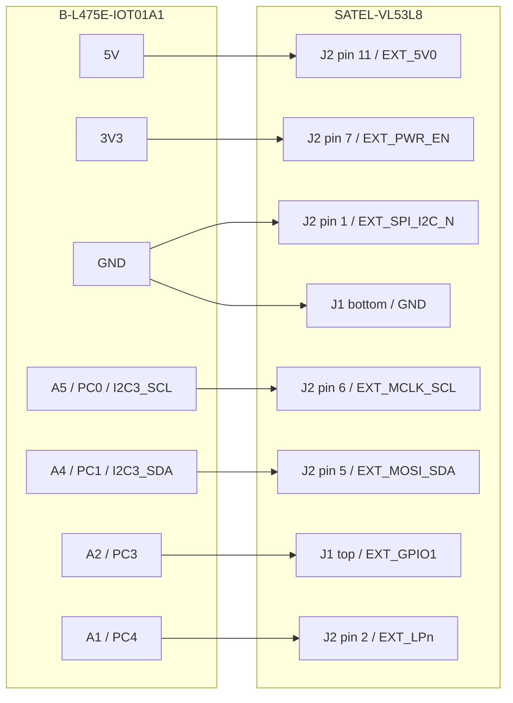
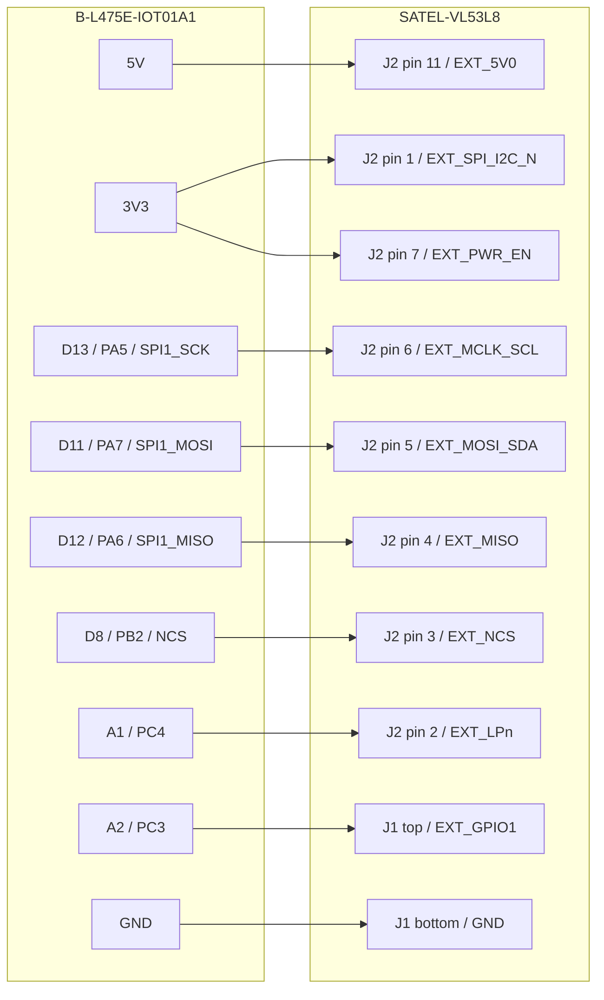

# 10 - SATEL-VL53L8 Firmware Bring-Up

This deployment uses SATEL-VL53L8 on the B-L475E-IOT01A1. The firmware probes
the rear slot over I2C3 first, then rear SPI1/D8, then the optional front
SPI1/D10 slot. It enables whichever sensor slots answer at boot.

Power off before changing `EXT_SPI_I2C_N` or any signal wire. Hot-swap is not
supported. VL53L0X, VL53L1CB, and VL53L5CX are deprecated for this deployment
path.

## Quick Choice

Use the same firmware image for both wiring modes:

| Mode | `J2 pin 1 EXT_SPI_I2C_N` | Main wires | Expected boot log |
| --- | --- | --- | --- |
| I2C, proven on bench | GND | A5 SCL, A4 SDA | `VL53L8 rear selected transport=i2c3` |
| SPI, ST-recommended next test | 3V3 | D13 SCK, D11 MOSI, D12 MISO, D8 NCS | `VL53L8 rear selected transport=spi1` |

The connected IOT01A1 and one SATEL board were verified in I2C mode on
2026-06-03. The boot log showed `i2c3` alive, `spi1` not alive, and stable
4x4 frames at about 31 fps.

For cable harness, snap-off mini-PCB, enclosure, and car-mounting guidance, see
`12-vl53l8-mechanical-integration.md`.

## Release Gate And Next Validation Order

Do not merge or tag the v1.2.0 release candidate just because host tests and
firmware builds pass. The hardware release gate is:

1. PR CI green for firmware host tests, firmware target build, and iOS tests.
2. One rear SATEL-VL53L8 re-verified after power cycle and firmware flash.
3. One-sensor safety supervisor bench-tested with the robot immobilized.
4. Release scope decision:
   - ship v1.2.0 as "one rear SATEL verified, two-sensor code ready"; or
   - wait for physical two-sensor SPI verification before v1.2.0.
5. Autonomous-mode work only after the firmware safety path is proven on
   hardware.

For the one-sensor safety bench test, the expected behavior is:

- reverse throttle can be clamped or braked by the rear SATEL when an obstacle
  violates the speed/distance rule;
- forward throttle is not clamped by a rear-only SATEL setup;
- selecting `Front` in iOS Debug while only rear is connected shows front as not
  online and clears the stale rear depth map;
- unplugged or unpowered SATEL produces visible UART probe failures and FE63
  error status instead of silently allowing Drive safety readiness.

## Single-Sensor Wiring

### Shared Power And Control

These connections are needed in both I2C and SPI modes:

| IOT01A1 | SATEL-VL53L8 | Purpose |
| --- | --- | --- |
| 5V | J2 pin 11 `EXT_5V0` | SATEL regulator input |
| GND | SATEL GND, or J1 bottom square pad | Common ground |
| 3V3, or D9 / PA15 when firmware drives it high | J2 pin 7 `EXT_PWR_EN` | Enable SATEL regulators |
| A1 / PC4 | J2 pin 2 `EXT_LPn` | Sensor reset / low-power control |
| A2 / PC3 | J1 top pad `EXT_GPIO1` | Optional data-ready input; firmware can poll |

For the first bring-up, tying `EXT_PWR_EN` to 3V3 is simplest. Using D9 later
is better for hard recovery, but it is not required for the one-sensor I2C test.

### I2C Mode Wiring

This is the mode already verified on the bench.

| IOT01A1 | MCU pin | SATEL-VL53L8 | Purpose |
| --- | --- | --- | --- |
| GND | board GND | J2 pin 1 `EXT_SPI_I2C_N` | Select I2C mode |
| A5 | PC0 / I2C3_SCL | J2 pin 6 `EXT_MCLK_SCL` | I2C clock |
| A4 | PC1 / I2C3_SDA | J2 pin 5 `EXT_MOSI_SDA` | I2C data |

The STM32 HAL uses 8-bit I2C addresses. The VL53L8 default 7-bit address is
`0x29`, represented as `0x52` in HAL calls.

### SPI Mode Wiring

Use this wiring for the next single-sensor SPI test.

| IOT01A1 | MCU pin | SATEL-VL53L8 | Purpose |
| --- | --- | --- | --- |
| 3V3 | board 3V3 | J2 pin 1 `EXT_SPI_I2C_N` | Select SPI mode |
| D13 | PA5 / SPI1_SCK | J2 pin 6 `EXT_MCLK_SCL` | SPI clock |
| D11 | PA7 / SPI1_MOSI | J2 pin 5 `EXT_MOSI_SDA` | SPI MOSI |
| D12 | PA6 / SPI1_MISO | J2 pin 4 `EXT_MISO` | SPI MISO |
| D8 | PB2 GPIO output | J2 pin 3 `EXT_NCS` | Rear chip select, idle high |

Important: D13 / PA5 is also connected to LD1 on the IOT01A1. In this firmware
branch PA5 belongs to SPI1 SCK, so LD1 is not a heartbeat LED. Use the UART
`LOOP` line as the main-loop heartbeat and LED2 as the VL53L8 frame indicator.

SPI starts conservatively: mode 3, MSB first, 8-bit words, software chip
select, and SPI1 prescaler 32.

## Connector Map

`J1` and `J2` are schematic connector reference names. They are not one
continuous 14-pin connector.

With the SATEL board oriented like Figure 1 in `satel-vl53l8.pdf`, the
snap-off mini-PCB is on the left of the red perforation line, and the larger
carrier board is on the right. `J1` is the short 3-hole header footprint near
the perforation. `J2` is the longer 11-hole expansion header footprint on the
carrier board. `J3` is the I/O-voltage select jumper and is not part of the
IOT01A1 wiring.

| Connector | Schematic part | Signals |
| --- | --- | --- |
| `J1` | 3-pin, 2.54 mm male header | top `EXT_GPIO1`, middle `EXT_GPIO2`, bottom square pad GND |
| `J2` | 11-pin, 2.54 mm male header | mode, reset, I2C/SPI, power-enable, and supply pins |

`J2` numbering:

| J2 pin | Signal | I2C use | SPI use |
| --- | --- | --- | --- |
| 1 | `EXT_SPI_I2C_N` | GND | 3V3 |
| 2 | `EXT_LPn` | A1 / PC4 | A1 / PC4 |
| 3 | `EXT_NCS` | Do not wire | D8 / PB2 |
| 4 | `EXT_MISO` | Do not wire | D12 / PA6 |
| 5 | `EXT_MOSI_SDA` | A4 / PC1 SDA | D11 / PA7 MOSI |
| 6 | `EXT_MCLK_SCL` | A5 / PC0 SCL | D13 / PA5 SCK |
| 7 | `EXT_PWR_EN` | 3V3 or D9 | 3V3 or D9 |
| 8 | `EXT_IOVDD` | Do not wire | Do not wire |
| 9 | `EXT_3V3` | Do not wire | Do not wire |
| 10 | `EXT_1V8` | Do not wire | Do not wire |
| 11 | `EXT_5V0` | 5V | 5V |

If a drawing says SATEL pin 12, pin 13, or pin 14, that is usually shorthand
for the three `J1` pads after counting the 11 pins of `J2`:

| Combined shorthand | J1 physical pad | Signal |
| --- | --- | --- |
| pin 12 | top round pad | `EXT_GPIO1` |
| pin 13 | middle round pad | `EXT_GPIO2` |
| pin 14 | bottom square pad | GND |

The yellow pads on the snap-off mini-PCB expose the tiny sensor board directly.
Do not use them for this bring-up. This design uses the full SATEL carrier board
so the regulators and level shifters stay in the signal path.

## Electrical Safety

Do not move these rails around:

- 5V goes to `J2 pin 11 EXT_5V0`, not to the mode pin.
- `J2 pin 1 EXT_SPI_I2C_N` is a logic mode input: GND for I2C, 3V3 for SPI.
- 5V on `J2 pin 1 EXT_SPI_I2C_N` is a logic over-voltage risk.
- 3V3 or 5V on `J2 pin 10 EXT_1V8` can damage a low-voltage rail.
- 3V3 or 5V on `J2 pin 8 EXT_IOVDD` can over-voltage the sensor I/O rail.
- `J2 pin 9 EXT_3V3` is not needed when using the 5V regulator-input path.

Before powering the board, identify `J2 pin 1` by the square pad at the bottom
of the 11-pin connector image, then count upward to pin 11. Identify `J1` by
position: top is `EXT_GPIO1`, middle is `EXT_GPIO2`, bottom square pad is GND.

## Old Wiring Corrections

If your SATEL pin numbers mean schematic connector pins, this is the correction
table for the earlier wiring attempt:

| Current connection | Check | Required correction |
| --- | --- | --- |
| IOT01A1 3V3 -> pin 11 `SPI_I2C_n` | Incorrect. J2 pin 11 is `EXT_5V0`, not `SPI_I2C_N`. | Move 5V to J2 pin 11. Use J2 pin 1 for mode select. |
| IOT01A1 5V -> pin 1 | Dangerous. J2 pin 1 is a logic mode input, not power. | Move 5V to J2 pin 11. |
| IOT01A1 A5 -> pin 6 `MCLK_SCL` | Correct for I2C. | Keep A5 on J2 pin 6 in I2C mode. |
| IOT01A1 A4 -> pin 7 `MOSI_SDA` | Incorrect. J2 pin 7 is `EXT_PWR_EN`, not SDA. | Move A4 to J2 pin 5; tie J2 pin 7 high. |
| IOT01A1 GND -> pin 14 GND | Correct only if pin 14 means J1 bottom square pad. | Keep common ground. |
| IOT01A1 A2 -> pin 12 `GPIO1 / INT` | Correct only if pin 12 means J1 top pad. | Keep as optional interrupt input. |
| IOT01A1 A1 -> pin 13 `GPIO2` | GPIO2 is not reset. | Prefer A1 / PC4 -> J2 pin 2 `EXT_LPn`. |

## Wiring Diagrams

### SATEL Connector Orientation

```text
SATEL-VL53L8 expansion connector view

J2, 11-pin header

    pin 11  EXT_5V0       <- IOT01A1 5V
    pin 10  EXT_1V8       <- DO NOT WIRE
    pin  9  EXT_3V3       <- DO NOT WIRE
    pin  8  EXT_IOVDD     <- DO NOT WIRE
    pin  7  EXT_PWR_EN    <- IOT01A1 3V3 or D9
    pin  6  EXT_MCLK_SCL  <- I2C SCL or SPI SCK
    pin  5  EXT_MOSI_SDA  <- I2C SDA or SPI MOSI
    pin  4  EXT_MISO      <- SPI MISO only
    pin  3  EXT_NCS       <- SPI chip select only
    pin  2  EXT_LPn       <- IOT01A1 A1 / PC4
    pin  1  EXT_SPI_I2C_N <- GND for I2C, 3V3 for SPI
            square pad

J1, 3-pad header

    top round pad     EXT_GPIO1 <- IOT01A1 A2 / PC3
    middle round pad  EXT_GPIO2 <- leave open for one-sensor bring-up
    bottom square pad GND       <- IOT01A1 GND
```

### One-Sensor I2C



### One-Sensor SPI



## Bring-Up Checklist

1. Power off the IOT01A1 before changing wires.
2. Wire either the I2C table or the SPI table, not both.
3. Confirm SATEL J2 pin 11 has 5V relative to GND.
4. Confirm J2 pin 1 is GND for I2C mode or 3V3 for SPI mode.
5. Confirm J2 pin 7 `EXT_PWR_EN` is high at 3V3.
6. Confirm J2 pin 10 `EXT_1V8`, pin 9 `EXT_3V3`, and pin 8 `EXT_IOVDD`
   have no external IOT01A1 wire attached.
7. For I2C, confirm A5/SCL and A4/SDA are not swapped.
8. For SPI, confirm D13/SCK, D11/MOSI, D12/MISO, and D8/NCS are not swapped.
9. Flash firmware, then watch UART1 for `VL53L8` probe and frame logs.

## Firmware Expectations

The active firmware path is:

```text
I2C3 on A5/A4 or SPI1 on D13/D12/D11
  -> boot-time transport probe
  -> rear/front VL53L8CX Ultra Lite Driver slots
  -> Tof_Frame_t 4x4/8x8 frame per available slot
  -> direction-specific safety selector using 4x4 row-3 center zones
  -> BLE ToF diagnostic stream
```

Expected I2C boot:

```text
VL53L8 rear probe transport=i2c3 pre_stop=0 alive_rd=0 alive=1
VL53L8 rear probe transport=spi1 ... alive=0
VL53L8 rear selected transport=i2c3
VL53L8 rear init phase=fw_done
VL53L8 rear stream start layout=4 zones=16 hz=30
VL53L8 rear frame layout=4 zones=16
```

Expected SPI boot:

```text
VL53L8 rear probe transport=i2c3 ... alive=0
VL53L8 rear probe transport=spi1 pre_stop=0 alive_rd=0 alive=1
VL53L8 rear selected transport=spi1
VL53L8 rear init phase=fw_done
VL53L8 rear stream start layout=4 zones=16 hz=30
VL53L8 rear frame layout=4 zones=16
```

`fps` is the number of frames received since the previous one-second frame log.
For the 4x4 safety configuration, expect roughly 29 to 31 fps.

Safety adapts to the available slots:

- Rear available only: reverse throttle can be clamped by rear ToF; forward
  throttle is not ToF-clamped.
- Front available only: forward throttle can be clamped by front ToF; reverse
  throttle is not ToF-clamped.
- Both available: reverse uses rear and forward uses front independently.
- No available VL53L8 slot: Drive throttle stays gated by the ToF safety-config
  readiness policy.

## Front/Rear Convention

Use these labels everywhere: wiring, firmware logs, BLE protocol, and the iOS
STM32 Control view.

| Role | Physical meaning | Current/future wiring |
| --- | --- | --- |
| `rear` / role byte `0` | Sensor faces backward; reverse safety uses it while the robot backs up. This is the current one-sensor bench setup. | I2C3 A5/A4 now, or SPI1 with D8 `NCS`; A1 `LPn`; A2 `GPIO1` |
| `front` / role byte `1` | Sensor faces forward; forward safety uses it while the robot drives forward. | SPI1 with D10 `NCS`; A0 `LPn`; A3 `GPIO1` |

The iOS debug selector chooses which role is published on FE62. It does not
turn the other sensor off. In Drive mode the firmware still keeps all detected
VL53L8 slots configured and the safety supervisor independently uses rear for
reverse motion and front for forward motion when each slot is available.

If the iOS app selects `front` while only the rear sensor is connected, the grid
stays blank and the app shows the selected front role as not online. That is the
expected one-sensor bench result, not a rear sensor failure.

## BLE Debug Protocol

FE61 is the iOS-to-firmware debug config. It is fixed-length 9 bytes:

| Offset | Field | Meaning |
| --- | --- | --- |
| 0 | `sensor_type` | `2` = `TOF_SENSOR_VL53L8CX` |
| 1 | `layout` | `4` or `8` |
| 2 | `profile` | `1` = continuous |
| 3 | `frequency_hz` | Debug ranging frequency |
| 4..5 | `integration_ms` | Little-endian integration time |
| 6..7 | `budget_ms` | Reserved for VL53L8; keep `0` |
| 8 | `debug_role` | `0` = rear FE62 stream, `1` = front FE62 stream |

The first eight bytes are the generic `Tof_Config_t` prefix. Firmware accepts
legacy 8-byte writes as rear-role writes for compatibility, but the current iOS
app writes all 9 bytes.

FE63 remains 4 bytes:

| Offset | Field | Meaning |
| --- | --- | --- |
| 0 | `state` | `0` idle, `1` running, `2` error |
| 1 | `last_error` | `Tof_Status_t`; `0` means no error |
| 2 | `scan_hz` | Observed debug-stream scan rate for the selected role |
| 3 | `debug` | bits 0..1 selected role; bits 4..5 available-role mask |

Available-role mask bits are bit 0 = rear online, bit 1 = front online. The iOS
STM32 Control view decodes this byte and shows the selected role as online or
not online.

## Build, Flash, And Serial Logs

Build and flash from the feature worktree:

```bash
cd /Users/fang/projects/openotter/.worktrees/vl53l8-satel-firmware/firmware/stm32-mcp
./build.sh all
```

On Apple Silicon, if `STM32_Programmer_CLI` exits with:

```text
Incompatible processor. This Qt build requires the following features:
    neon
```

use the x86_64 slice through Rosetta:

```bash
arch -x86_64 /opt/st/STM32CubeCLT_1.21.0/STM32CubeProgrammer/bin/STM32_Programmer_CLI \
  --connect port=SWD reset=SWrst \
  --download build/Debug/stm32-mcp.elf \
  --verify \
  --go
```

Open ST-LINK serial on macOS:

```bash
ls /dev/cu.usbmodem*
screen /dev/cu.usbmodemXXXX 115200
```

To exit `screen`, press `Ctrl-A`, then `Ctrl-\`, then confirm.

### Expected Logs With No Sensor Power

With only the IOT01A1 powered, the firmware should boot and retry the sensor
path. You should see both transports probe as not alive:

```text
VL53L8 rear probe transport=i2c3 pre_stop=... alive_rd=... alive=0
VL53L8 rear probe transport=spi1 pre_stop=... alive_rd=... alive=0
VL53L8 front probe transport=spi1 pre_stop=... alive_rd=... alive=0
VL53L8 init: no usable sensors ...
```

That proves the firmware is alive, the lazy VL53L8 bring-up path is running,
and failures are visible before the SATEL board has power.

### Proving 8x8 Depth Maps

Drive mode intentionally runs the VL53L8 as a 4x4, 30 Hz safety input. To prove
the full debug depth map, use the iOS diagnostics STM32 control view to switch
firmware to Debug mode and write the VL53L8 config:

| Field | Value |
| --- | --- |
| sensor | `VL53L8CX` |
| role | `rear` for the current bench sensor, `front` after the second sensor is connected |
| layout | `8` |
| profile | continuous |
| frequency | `10 Hz` or `15 Hz` |
| integration | `20 ms` |

The serial proof is a frame line with `layout=8` and `zones=64`:

```text
VL53L8 stream start layout=8 zones=64 hz=10 it=20 readBytes=...
VL53L8 frame layout=8 zones=64 seq=23 fps=11 targetZones=34
```

If serial shows `layout=8 zones=64` but iOS does not render the grid, debug the
BLE frame reassembly path next. If serial never reaches `layout=8 zones=64`,
debug the firmware config write or sensor transport path first.

The 1 Hz debug log should also show the selected role and available mask:

```text
L8 dbg: seen=... snap=... push=... fail=... mode=1 role=rear avail=0x01 ...
```

## Two-Sensor Runtime

The runtime supports either one or two available VL53L8 slots at boot. The
current bench hardware verifies one rear I2C sensor. The front SPI slot is wired
and probed in firmware, but it still needs physical bench verification after the
second SATEL board is installed.

The HAL-free topology contract lives in `Core/Src/tof_l8_topology.c` and is
covered by `tests/host/test_tof_l8_topology.c`. The core invariants are:

- SPI slots sharing a bus must not share chip select.
- I2C slots sharing a bus must not share runtime address.
- Two online sensors must not share `LPn`.

### IOT01A1 Pin Allocation

The PWM outputs are already occupied:

| IOT01A1 pin | MCU pin | Current use |
| --- | --- | --- |
| A6 / near Arduino analog header | PB1 / TIM3_CH4 | Steering PWM |
| D5 | PB4 / TIM3_CH1 | Throttle PWM |

The preferred ToF pins avoid those PWM outputs and avoid the BLE SPI3 pins:

| Role | IOT01A1 pin | MCU pin |
| --- | --- | --- |
| Shared SPI clock | D13 | PA5 / SPI1_SCK |
| Shared MOSI | D11 | PA7 / SPI1_MOSI |
| Shared MISO | D12 | PA6 / SPI1_MISO |
| Rear `NCS` | D8 | PB2 |
| Front `NCS` | D10 | PA2 |
| Rear `LPn` | A1 | PC4 |
| Front `LPn` | A0 | PC5 |
| Rear `GPIO1` | A2 | PC3 |
| Front `GPIO1` | A3 | PC2 |
| Rear `PWR_EN` | D9 later, or 3V3 first | PA15 later, or board 3V3 first |
| Front `PWR_EN` | 3V3 first; later a free GPIO | board 3V3 first |

Pins to avoid for this ToF expansion:

- PB1 and PB4 are active PWM outputs.
- PB6/PB7 are the ST-LINK UART log.
- PC10/PC11/PC12, PD13, PA8, and PE6 are BlueNRG-MS BLE pins.
- PA13/PA14 are SWD.
- PC6 must stay low only for the fallback I2C1 plan, where the front SATEL
  shares the on-board VL53L0X default address.

### Recommended Two-Sensor SPI Wiring

Both sensors share power and the SPI data bus. Each sensor gets its own chip
select and reset line.

| Signal | Rear SATEL | Front SATEL |
| --- | --- | --- |
| `EXT_5V0` | Shared 5V -> J2 pin 11 | Shared 5V -> J2 pin 11 |
| GND | Shared GND | Shared GND |
| `EXT_SPI_I2C_N` | 3V3 -> J2 pin 1 | 3V3 -> J2 pin 1 |
| `EXT_MCLK_SCL` / SCK | D13 / PA5 -> J2 pin 6 | D13 / PA5 -> J2 pin 6 |
| `EXT_MOSI_SDA` / MOSI | D11 / PA7 -> J2 pin 5 | D11 / PA7 -> J2 pin 5 |
| `EXT_MISO` / MISO | D12 / PA6 -> J2 pin 4 | D12 / PA6 -> J2 pin 4 |
| `EXT_NCS` | D8 / PB2 -> J2 pin 3 | D10 / PA2 -> J2 pin 3 |
| `EXT_LPn` | A1 / PC4 -> J2 pin 2 | A0 / PC5 -> J2 pin 2 |
| `EXT_GPIO1` | A2 / PC3 -> J1 top pad | A3 / PC2 -> J1 top pad |
| `EXT_PWR_EN` | D9 / PA15, or 3V3 | 3V3 for first test, later a free GPIO |

Invariant: only one `NCS` may be low at a time. That prevents both sensors from
driving MISO at once.

The iOS STM32 Control view uses the same table: the `Rear` selector maps to the
rear SATEL wiring, and the `Front` selector maps to the front SATEL wiring. With
both sensors online, switching the selector changes only the debug depth map;
both physical sensors continue ranging for safety.

Expected two-sensor SPI logs:

```text
VL53L8 rear selected transport=spi1
VL53L8 front selected transport=spi1
VL53L8 rear stream start layout=4 zones=16 hz=30
VL53L8 front stream start layout=4 zones=16 hz=30
VL53L8 rear frame layout=4 zones=16 ...
VL53L8 front frame layout=4 zones=16 ...
```

### Fallback Separate-I2C Wiring

If SPI bring-up fails, the fallback is rear on I2C3 and front on I2C1:

| Signal | Rear SATEL | Front SATEL |
| --- | --- | --- |
| `EXT_SPI_I2C_N` | GND | GND |
| `EXT_MCLK_SCL` | A5 / PC0 / I2C3_SCL | D15 / PB8 / I2C1_SCL |
| `EXT_MOSI_SDA` | A4 / PC1 / I2C3_SDA | D14 / PB9 / I2C1_SDA |
| `EXT_LPn` | A1 / PC4 | A0 / PC5 |
| `EXT_GPIO1` | A2 / PC3 | A3 / PC2 |

Keep `VL53L0X_XSHUT` / PC6 low when the front SATEL uses I2C1 at the default
address, because the on-board VL53L0X also uses `0x29`.

### Shared-I2C Fallback

Two SATEL boards may share one SCL/SDA pair only after firmware gives the two
awake sensors different runtime I2C addresses. Both sensors boot at `0x29`
7-bit / `0x52` HAL 8-bit, so two awake sensors at default address collide.

Shared-I2C boot sequence:

1. Hold both `LPn` lines low.
2. Release one sensor only.
3. Initialize it at default `0x52`.
4. Call `vl53l8cx_set_i2c_address()` to move it to a unique address such as
   `0x54`.
5. Release the second sensor.
6. Initialize the second sensor at default `0x52`, or move it to another unique
   address such as `0x56`.

This shared-I2C address sequencing is not implemented yet. The implemented
two-sensor path is shared SPI1 with separate chip selects and separate `LPn`.

## Bench Evidence

I2C mode was verified on 2026-06-03 after flashing the feature firmware:

```text
VL53L8 probe transport=i2c3 pre_stop=0 alive_rd=0 alive=1
VL53L8 probe transport=spi1 pre_stop=0 alive_rd=0 alive=0
VL53L8 selected transport=i2c3
VL53L8 init phase=fw_done
VL53L8 stream start layout=4 zones=16 hz=30 it=20 readBytes=128
VL53L8 frame layout=4 zones=16 seq=32 fps=31 targetZones=15
center=399,387,407,388 cst=5,5,5,5
```

The adaptive rear/front-slot firmware was flashed and verified on 2026-06-03
with the same one rear I2C sensor connected:

```text
VL53L8 rear frame layout=4 zones=16 seq=807 fps=31 targetZones=14
center=362,326,382,377 cst=5,4,5,5
VL53L8 rear grid r/s/f: 385/5/1 326/4/1 2298/5/1 ...
```

Earlier 2026-06-02 evidence also proved live 4x4 safety frames and a temporary
8x8 diagnostic frame path over I2C.

## Troubleshooting

| Symptom | First checks |
| --- | --- |
| No sensor, both transports `alive=0` | `EXT_5V0`, GND, `EXT_PWR_EN`, `LPn`, and mode pin |
| I2C selected unexpectedly | `EXT_SPI_I2C_N` is probably tied low or SPI wires are incomplete |
| SPI selected unexpectedly | `EXT_SPI_I2C_N` is high; this is SPI mode |
| `alive=1` but no frames | Firmware download or stream config failed; check UART logs around `fw_download` |
| Mostly tiny or zero ranges | Remove film/cover, aim at matte target 20-80 cm away, keep wires away from aperture |

For frame logs, each compact grid cell is:

```text
range_mm/status/target_count
```

Valid VL53L8CX range statuses for safety are `5`, `6`, `9`, or `10`. Status
`4` means target consistency failed and must not be used as a safety distance.

## Source Documents

- `docs/hardware/sensors/satel-vl53l8-schematic.pdf`
- `docs/hardware/sensors/satel-vl53l8.pdf`
- `docs/hardware/sensors/an5945-how-to-connect-the-satelvl53l8-to-an-stm32-nucleo64-board-stmicroelectronics.pdf`
- ST-maintained STM32duino `VL53L8CX` SATEL wiring example, which confirms
  `SPI_I2C_N` low for I2C mode and high for SPI mode.
