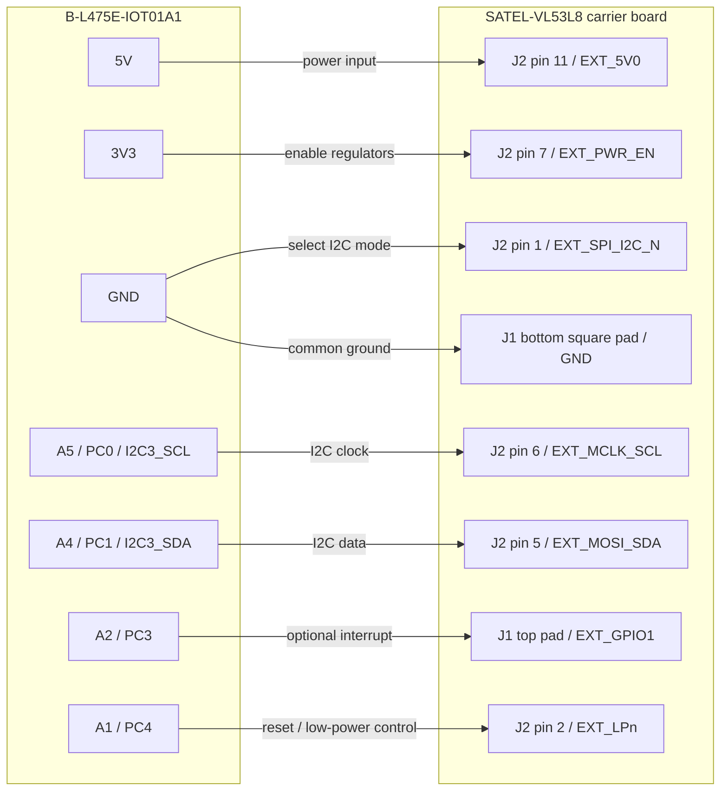
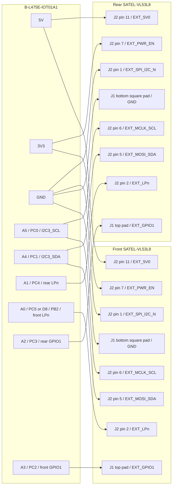

# 10 — SATEL-VL53L8 Firmware Bring-Up

This deployment uses SATEL-VL53L8 on the B-L475E-IOT01A1 over I2C3. VL53L0X,
VL53L1CB, and VL53L5CX are deprecated for this deployment path.

## Source Documents

- `docs/hardware/sensors/satel-vl53l8-schematic.pdf`
- `docs/hardware/sensors/satel-vl53l8.pdf`
- `docs/hardware/sensors/an5945-how-to-connect-the-satelvl53l8-to-an-stm32-nucleo64-board-stmicroelectronics.pdf`
- ST-maintained STM32duino `VL53L8CX` SATEL wiring example, which confirms
  `SPI_I2C_N` low for I2C mode and high for SPI mode.

## Finding J1 And J2 On The SATEL Board

`J1` and `J2` are schematic connector reference names, not one continuous
14-pin connector. The SATEL schematic calls them:

| Connector | Schematic part | What it carries |
| --- | --- | --- |
| `J1` | 3-pin, 2.54 mm male header | top pad `EXT_GPIO1`, middle pad `EXT_GPIO2`, bottom square pad GND |
| `J2` | 11-pin, 2.54 mm male header | mode, reset, I2C/SPI, power-enable, and supply pins |

With the SATEL board oriented like Figure 1 in `satel-vl53l8.pdf`:

- the snap-off mini-PCB is on the left of the red perforation line;
- the larger carrier board is on the right of the red perforation line;
- `J1` is the short 3-hole expansion header footprint near the perforation;
- `J2` is the longer 11-hole expansion header footprint on the carrier board;
- `J3` is the I/O-voltage select jumper and is not part of the IOT01A1 wiring.

Do not treat the board as a single 14-pin header. If a diagram says SATEL
pin 12, pin 13, or pin 14, that is usually shorthand for the three `J1` pads
after counting the 11 pins of `J2`. In the ST connector image, those signals
are the `J1` pads by physical position:

| Combined shorthand | J1 physical pad | Signal |
| --- | --- | --- |
| pin 12 | top round pad | `EXT_GPIO1` |
| pin 13 | middle round pad | `EXT_GPIO2` |
| pin 14 | bottom square pad | GND |

`J2` is numbered separately:

| J2 pin | Signal | Use in this project |
| --- | --- | --- |
| 1 | `EXT_SPI_I2C_N` | Tie low to GND for I2C mode |
| 2 | `EXT_LPn` | Optional host reset/enable control |
| 3 | `EXT_NCS` | SPI chip-select; unused for I2C |
| 4 | `EXT_MISO` | SPI MISO; unused for I2C |
| 5 | `EXT_MOSI_SDA` | I2C3 SDA from IOT01A1 A4 / PC1 |
| 6 | `EXT_MCLK_SCL` | I2C3 SCL from IOT01A1 A5 / PC0 |
| 7 | `EXT_PWR_EN` | Tie high to 3V3 to enable SATEL regulators |
| 8 | `EXT_IOVDD` | Do not wire for this bring-up |
| 9 | `EXT_3V3` | Do not wire for this bring-up |
| 10 | `EXT_1V8` | Do not wire; low-voltage rail |
| 11 | `EXT_5V0` | 5V input to the SATEL regulators |

The yellow pads on the snap-off mini-PCB expose the tiny sensor board directly.
Those pads are useful only if the mini-PCB is broken off and powered/level-shifted
as a separate 1.8 V design. The wiring below assumes the full SATEL carrier board
is used, because the carrier provides the required regulators and level shifters.

## Electrical Safety Notes

The full SATEL carrier board expects two different kinds of connections:

- one power input: IOT01A1 5V to `J2` pin 11 `EXT_5V0`;
- one mode-select low: IOT01A1 GND to `J2` pin 1 `EXT_SPI_I2C_N`
  for I2C mode;
- one 3.3 V logic high: IOT01A1 3V3 to `J2` pin 7 `EXT_PWR_EN`;
- 3.3 V open-drain I2C signals: A5/SCL and A4/SDA;
- common ground.

Do not move these rails around:

- 3V3 on `J2` pin 1 `EXT_SPI_I2C_N` selects the SPI-side mode; for the
  I2C wiring in this project it should be tied to GND.
- 5V on `J2` pin 1 `EXT_SPI_I2C_N` is a logic over-voltage risk.
- 3V3 or 5V on `J2` pin 10 `EXT_1V8` can over-voltage a low-voltage rail.
- 3V3 or 5V on `J2` pin 8 `EXT_IOVDD` can over-voltage the sensor I/O rail.
- 3V3 on `J2` pin 11 `EXT_5V0` is not the intended regulator input and can
  create brown-out symptoms that look like firmware or I2C bugs.
- `J2` pin 9 `EXT_3V3` is not needed when using the 5V regulator-input path;
  do not tie it to IOT01A1 3V3 for this bring-up.

Before powering the board, identify `J2` pin 1 by the square pad at the bottom
of the 11-pin connector image, then count upward to pin 11. Identify `J1` by
signal position: top is `EXT_GPIO1`, middle is `EXT_GPIO2`, bottom square pad
is GND.

Do not hot-plug these wires. If the board has already been powered with the
wrong wiring, power it off, remove every flying lead, identify the connector
pins again, then reconnect from the corrected table. If anything is uncertain,
connect only 5V, 3V3 mode/enable, and GND first, then measure the rails before
adding SCL/SDA or GPIO wires.

## Current Wiring Check

If your SATEL pin numbers mean schematic connector pins, the current wiring is
not fully correct.

| Current connection | Check | Required correction |
| --- | --- | --- |
| IOT01A1 3V3 -> pin 11 `SPI_I2C_n` | Incorrect. J2 pin 11 is `EXT_5V0`, not `SPI_I2C_N`. 3V3 there is not the intended 5V regulator input and does not select I2C mode. | Move 5V to J2 pin 11 `EXT_5V0`; tie J2 pin 1 `EXT_SPI_I2C_N` to GND for I2C mode; tie J2 pin 7 `EXT_PWR_EN` to 3V3. |
| IOT01A1 5V -> pin 1 | Dangerous. J2 pin 1 is `EXT_SPI_I2C_N`, a logic input, not a 5V power input. | Move 5V to J2 pin 11 `EXT_5V0`. |
| IOT01A1 A5 -> pin 6 `MCLK_SCL` | Correct. | Keep J2 pin 6 `EXT_MCLK_SCL`. |
| IOT01A1 A4 -> pin 7 `MOSI_SDA` | Incorrect. J2 pin 7 is `EXT_PWR_EN`, not SDA. | Move A4 / PC1 to J2 pin 5 `EXT_MOSI_SDA`; tie J2 pin 7 high to 3V3. |
| IOT01A1 GND -> pin 14 GND | Correct only if pin 14 means the bottom square pad of `J1`. | Keep common ground. |
| IOT01A1 A2 -> pin 12 `GPIO1 / INT` | Correct only if pin 12 means the top pad of `J1`. | Keep for optional data-ready interrupt input. Firmware can poll first. |
| IOT01A1 A1 -> pin 13 `GPIO2` | The middle pad of `J1` is GPIO2, but GPIO2 is not the reset/enable line. | Prefer A1 / PC4 -> J2 pin 2 `EXT_LPn`. Leave GPIO2 unconnected unless using sync later. |

## Correct One-Sensor Wiring

| IOT01A1 | MCU pin | SATEL-VL53L8 | Purpose |
| --- | --- | --- | --- |
| 5V | board 5V | J2 pin 11 `EXT_5V0` | SATEL regulator input |
| GND | board GND | J2 pin 1 `EXT_SPI_I2C_N` | Select I2C mode |
| 3V3 | board 3V3 | J2 pin 7 `EXT_PWR_EN` | Enable SATEL regulators |
| A5 | PC0 / I2C3_SCL | J2 pin 6 `EXT_MCLK_SCL` | I2C clock |
| A4 | PC1 / I2C3_SDA | J2 pin 5 `EXT_MOSI_SDA` | I2C data |
| A2 | PC3 | J1 top pad `EXT_GPIO1` | Data-ready interrupt input; firmware can poll first |
| A1 | PC4 | J2 pin 2 `EXT_LPn` | Sensor low-power/reset control |
| GND | GND | J1 bottom square pad GND or SATEL GND | Common ground |

`SPI_I2C_N` must be low for I2C mode. `PWR_EN` should be high for the full
SATEL board regulators unless the board assembly already straps it high.

## Connection Diagrams

### SATEL Connector Orientation

Use this view when looking at the ST connector image: `J2` pin 1 is the bottom
square pad, then the numbers count upward to pin 11. `J1` is the separate
3-pad header below `J2`.

```text
SATEL-VL53L8 expansion connector view

J2, 11-pin header

    pin 11  EXT_5V0       <- IOT01A1 5V
    pin 10  EXT_1V8       <- DO NOT WIRE
    pin  9  EXT_3V3       <- DO NOT WIRE
    pin  8  EXT_IOVDD     <- DO NOT WIRE
    pin  7  EXT_PWR_EN    <- IOT01A1 3V3
    pin  6  EXT_MCLK_SCL  <- IOT01A1 A5 / PC0 / I2C3_SCL
    pin  5  EXT_MOSI_SDA  <- IOT01A1 A4 / PC1 / I2C3_SDA
    pin  4  EXT_MISO      <- DO NOT WIRE
    pin  3  EXT_NCS       <- DO NOT WIRE
    pin  2  EXT_LPn       <- IOT01A1 A1 / PC4
    pin  1  EXT_SPI_I2C_N <- IOT01A1 GND
            square pad

J1, 3-pad header

    top round pad     EXT_GPIO1 <- IOT01A1 A2 / PC3
    middle round pad  EXT_GPIO2 <- leave open for one-sensor bring-up
    bottom square pad GND       <- IOT01A1 GND
```

### One-Sensor Wiring



Do not add wires to `J2` pin 10 `EXT_1V8`, pin 9 `EXT_3V3`, or pin 8
`EXT_IOVDD` for this bring-up. The full SATEL carrier board derives the sensor
rails from `EXT_5V0` and uses level shifters for the IOT01A1 3.3 V signals.

### Two-Sensor Future Topology

Two SATEL boards can share power, ground, SCL, SDA, `SPI_I2C_N`, and `PWR_EN`.
Each board needs its own `LPn` line so firmware can hold one sensor off while
it boots and re-addresses the other sensor at the default I2C address.



## Firmware Expectations

The active firmware path is:

```text
I2C3 on A5/A4
  -> VL53L8CX Ultra Lite Driver
  -> Tof_Frame_t 4x4/8x8 frame
  -> reverse safety selector using 4x4 row-3 center zones
  -> BLE ToF diagnostic stream
```

The STM32 HAL uses 8-bit I2C addresses. The VL53L8 default 7-bit address is
`0x29`, represented as `0x52` in HAL calls.

## Two-Sensor Wiring Plan

Two VL53L8 sensors cannot both be active at the default I2C address. They must
share SCL/SDA only while each has an independently controlled `LPn` line so the
firmware can boot and re-address them one at a time.

| Signal | Rear SATEL | Front SATEL |
| --- | --- | --- |
| `EXT_MCLK_SCL` | Shared A5 / PC0 | Shared A5 / PC0 |
| `EXT_MOSI_SDA` | Shared A4 / PC1 | Shared A4 / PC1 |
| `EXT_5V0` | Shared 5V -> J2 pin 11 | Shared 5V -> J2 pin 11 |
| `EXT_SPI_I2C_N` | Shared GND | Shared GND |
| `EXT_PWR_EN` | Shared 3V3 | Shared 3V3 |
| GND | Shared GND | Shared GND |
| `EXT_LPn` | Dedicated A1 / PC4 | Dedicated A0 / PC5 or D8 / PB2 |
| `EXT_GPIO1` | Dedicated A2 / PC3 -> J1 top pad | Dedicated A3 / PC2 -> J1 top pad |

Future boot sequence:

1. Hold both `LPn` lines low.
2. Release rear `LPn`.
3. Initialize rear at default address and assign the rear address.
4. Release front `LPn`.
5. Initialize front at default address and assign the front address.
6. Poll or interrupt each sensor independently.

Do not wire two SATEL boards with shared `LPn` unless only one is populated or
only one is powered.

## Bring-Up Checklist

1. Power off the IOT01A1 before changing wires.
2. Wire according to the corrected one-sensor table.
3. Confirm SATEL J2 pin 11 has 5V relative to GND.
4. Confirm J2 pin 1 is at GND and J2 pin 7 is high at 3V3.
5. Confirm J2 pin 10 `EXT_1V8` and J2 pin 8 `EXT_IOVDD` have no external
   IOT01A1 wire attached.
6. Confirm A5/SCL and A4/SDA are not swapped.
7. Flash firmware.
8. Watch UART1 for a `VL53L8` probe line.
9. If the probe fails, check `PWR_EN`, ground, SCL/SDA order, and whether
   `LPn` is held low.

## Firmware Debug Workflow

Use the ST-LINK USB connector on the IOT01A1 for both flashing and serial
logs. Do not power the SATEL board until the firmware is flashed and the UART
monitor is ready; that keeps the first sensor boot sequence visible.

### Build And Flash From The Feature Worktree

Install local vendor dependencies first. The STM32 HAL and VL53L8 Ultra Lite
Driver are intentionally not tracked in git:

```bash
cd /Users/fang/projects/openotter/.worktrees/vl53l8-satel-firmware/firmware/stm32-mcp
./scripts/fetch-deps.sh --vl53l8cx-path /path/to/extracted/STSW-IMG040
```

Then build and flash:

```bash
cd /Users/fang/projects/openotter/.worktrees/vl53l8-satel-firmware/firmware/stm32-mcp
./build.sh all
```

On Apple Silicon, if `STM32_Programmer_CLI` exits with:

```text
Incompatible processor. This Qt build requires the following features:
    neon
```

use the x86_64 slice through Rosetta:

```bash
arch -x86_64 /opt/ST/STM32CubeCLT_1.21.0/STM32CubeProgrammer/bin/STM32_Programmer_CLI \
  --connect port=SWD reset=SWrst \
  --download build/Debug/stm32-mcp.elf \
  --verify \
  --go
```

If the firmware is already built, flash only:

```bash
cd /Users/fang/projects/openotter/.worktrees/vl53l8-satel-firmware/firmware/stm32-mcp
./build.sh flash
```

### Open The ST-LINK Serial Log On macOS

Find the virtual serial device:

```bash
ls /dev/cu.usbmodem*
```

Open it at 115200 8N1:

```bash
screen /dev/cu.usbmodemXXXX 115200
```

To exit `screen`, press `Ctrl-A`, then `Ctrl-\`, then confirm.

### Expected Logs Before SATEL Power

With only the IOT01A1 powered, the firmware should boot and retry the sensor
path. You should see lines like:

```text
[1000] BLE_Tof safety_config fire mode=0 tick=1000
[1000] VL53L8 init phase=gpio tick=1000
[1012] VL53L8 init phase=is_alive
[1018] VL53L8 probe: no sensor addr=0x52
```

That is expected before the SATEL board has power. It proves the firmware is
alive, the lazy VL53L8 bring-up path is running, and failures are observable.

### Expected Logs After SATEL Power

After applying the corrected wiring and powering the SATEL board, the retry path
should eventually reach firmware download, configuration, and frame logs:

```text
[4000] VL53L8 init phase=is_alive
[4010] VL53L8 pre-stop=... alive_rd=0 alive=1 tick=4010
[4010] VL53L8 init phase=fw_download tick=4010
[9000] VL53L8 init phase=fw_done tick=9000
[9020] VL53L8 stream start layout=4 zones=16 hz=30 it=20 readBytes=...
[9050] VL53L8 frame layout=4 zones=16 seq=1 fps=... targetZones=...
```

Drive mode uses `layout=4` because reverse safety intentionally runs the sensor
as a 4x4, 30 Hz safety input.

`fps` is the number of frames received since the previous one-second frame log.
For the 4x4 safety configuration, expect roughly `29` to `30` after the ST
driver output list is trimmed to target count, distance, and target status in
`cmake/stm32cubemx/CMakeLists.txt`.

### Proving 8x8 Depth Maps

To prove the sensor is returning the full debug depth map, switch firmware to
Debug mode from the iOS debug view and write the VL53L8 config with:

| Field | Value |
| --- | --- |
| sensor | `VL53L8CX` |
| layout | `8` |
| profile | continuous |
| frequency | `10 Hz` or `15 Hz` |
| integration | `20 ms` |

The serial proof is a frame line with `layout=8` and `zones=64`:

```text
[12345] VL53L8 stream start layout=8 zones=64 hz=10 it=20 readBytes=...
[12420] VL53L8 frame layout=8 zones=64 seq=23 fps=11 targetZones=34 ...
```

The `z0`, `zLast`, and `center` values are millimeters copied from the current
frame. Zero can be valid for a zone with no target; point the sensor at a flat
object roughly 20-80 cm away to make several center values non-zero.

The iOS debug view should also receive the same 64-zone frame over FE62. If
serial shows `layout=8 zones=64` but iOS does not render the grid, debug the
BLE frame reassembly path next. If serial never reaches `layout=8 zones=64`,
debug the firmware config write or sensor path first.

### Interpreting Frame Logs

The frame summary prints only valid-range counts:

```text
VL53L8 frame layout=4 zones=16 seq=241 fps=29 targetZones=4 min=15 max=21 ...
```

`targetZones` counts zones with a target, a non-zero range, and a VL53L8CX
valid status (`5`, `6`, `9`, or `10`). Status `4` means target consistency
failed and must not be used as a safety distance.

### Current Bench Evidence

On 2026-06-02, the connected IOT01A1 and one SATEL-VL53L8 were verified over
ST-LINK serial with the production safety firmware restored:

```text
VL53L8 frame layout=4 zones=16 seq=117 fps=29 targetZones=4 min=16 max=22 ...
VL53L8 frame layout=4 zones=16 seq=466 fps=30 targetZones=4 min=17 max=22 ...
```

A temporary diagnostic firmware pass also proved full 8x8 frame acquisition:

```text
VL53L8 frame layout=8 zones=64 seq=23 fps=11 targetZones=34 min=4 max=21 ...
VL53L8 frame layout=8 zones=64 seq=320 fps=11 targetZones=35 min=4 max=22 ...
```

Those logs prove the I2C wiring, LPn release, ST driver platform callbacks,
firmware download, ranging start, and frame-copy path. An immediate MCU-only
flash/reset later left the SATEL not acknowledging I2C (`alive=0`) until the
board was physically disconnected and reconnected.

After that USB power cycle, the production 4x4 safety firmware produced stable,
plausible center depth values:

```text
VL53L8 frame layout=4 zones=16 seq=2008 fps=31 targetZones=16 min=1720 max=2177 center=1927,1979,1849,1910 cst=5,5,5,5
VL53L8 frame layout=4 zones=16 seq=3338 fps=31 targetZones=16 min=177 max=321 center=315,293,307,284 cst=5,5,5,5
```

That final evidence proves the one-sensor driver and firmware path can acquire
usable 4x4 depth maps. If a later flash shows `alive=0` again, power-cycle the
SATEL/IOT01A1 and re-check the `LPn` wire before changing firmware.

The compact 4x4 grid log prints each zone as:

```text
range_mm/status/target_count
```

Example:

```text
VL53L8 grid r/s/f: 0/4/1 0/4/1 0/4/1 17/5/1 | ...
```

In this example, `0/4/1` means the sensor saw something target-like but the
range is invalid. `17/5/1` means status valid, but the measured distance is
only 17 mm. If most valid zones stay at roughly 15-25 mm while the sensor is
aimed at a wall or flat target 20-80 cm away, treat it as a physical/optical
problem first:

- remove any protective film, tape, foam, or cover from the VL53L8 aperture;
- make sure the SATEL board is not face-down against the bench;
- keep fingers and jumper wires away from the optical window;
- aim the sensor at a matte flat target at least 20 cm away;
- then re-check that the grid changes to larger valid ranges in the center
  zones.
