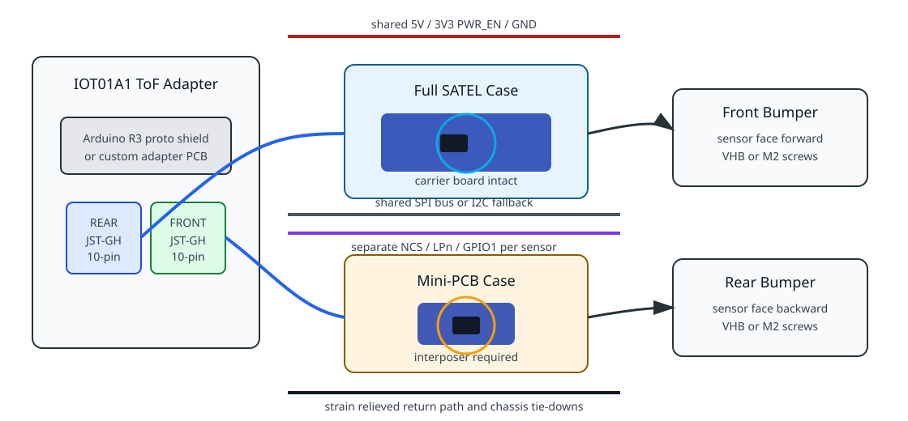
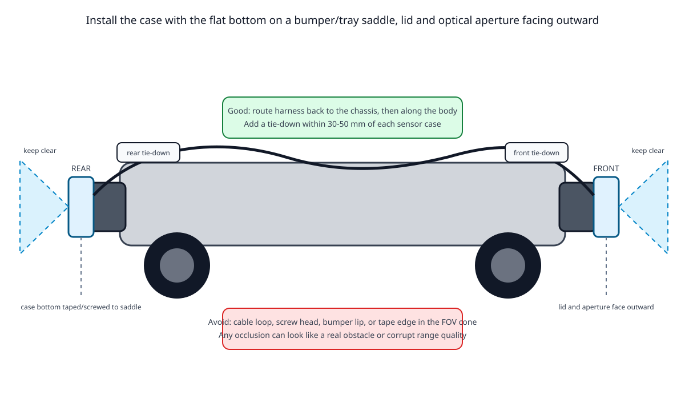
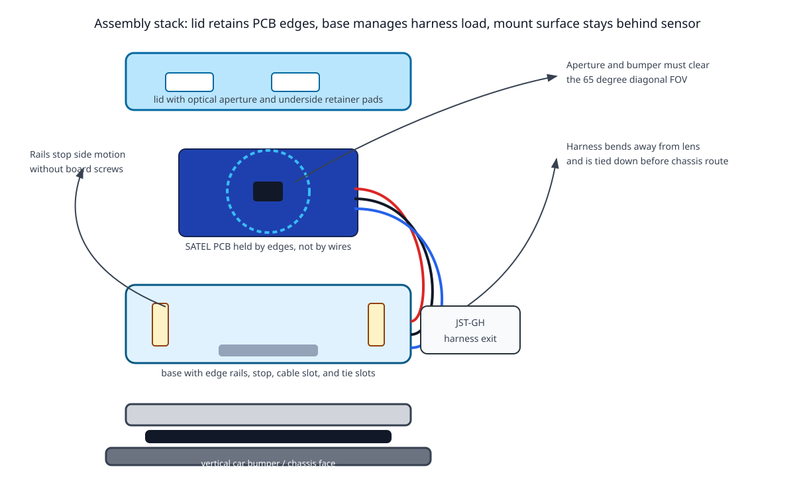
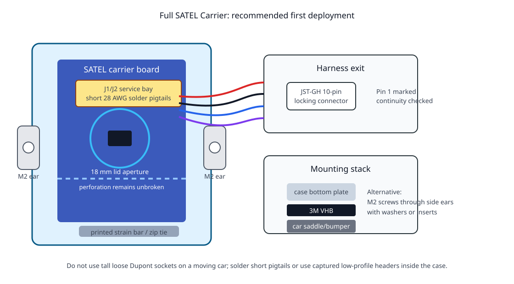
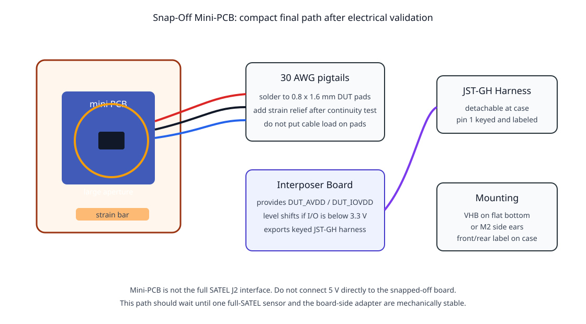
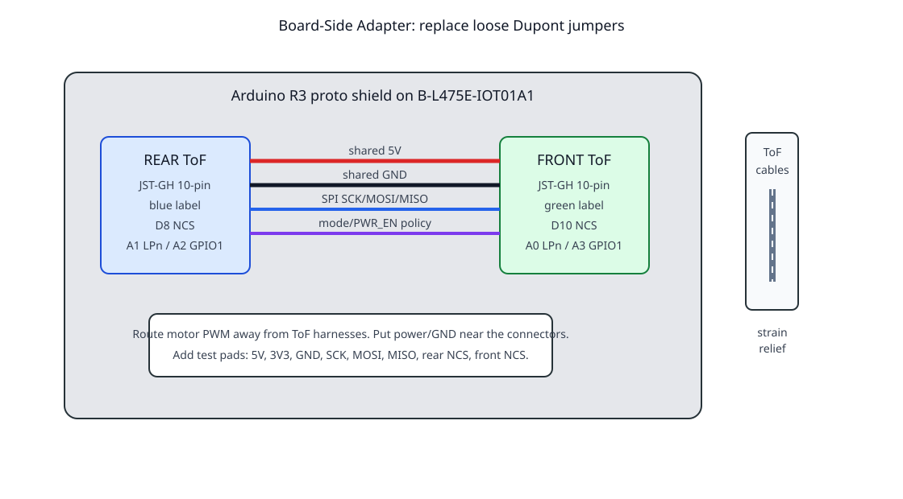

# 12 - SATEL-VL53L8 Mechanical Integration

This document covers the deployment hardware path after the bench Dupont-wire
prototype: cable harness, board-side connection, full-SATEL case,
snap-off-mini-PCB case, solder strain relief, and front/rear mounting.

The firmware can already work with one or two VL53L8 sensors. This document is
about making the physical system reliable enough for a moving RC car.

## Design Summary

Use two mechanical designs, not one:

1. **Full SATEL carrier case**
   - Recommended for the next deployment and v1.2 validation.
   - Keeps the SATEL regulators, level translators, and full J1/J2 connector
     interface.
   - Larger, but electrically safer and easier to debug.

2. **Snap-off mini-PCB case**
   - Recommended only after the full-carrier path is stable.
   - Much smaller and better for final packaging.
   - Requires deliberate `DUT_AVDD`, `DUT_IOVDD`, and GPIO voltage-domain
     design. Do not wire IOT01A1 5 V directly to the snapped-off board.

The near-term robot should use full SATEL carrier cases at the front and rear.
The mini-PCB path should be treated as a second mechanical/electrical revision.



## Current Prototype Problem

The photo-based prototype works for firmware bring-up, but it is not suitable
for a moving RC car:

- long Dupont jumpers are stiff and unsupported;
- the SATEL board is held by the wires, not by a mechanical reference;
- the IOT01A1 header connections can be bumped loose;
- the sensor has no strain relief, no datum, and no repeatable front/rear
  pointing angle;
- the sensor board can move when the car moves, which makes ToF data look like
  firmware noise even when the driver is healthy.

The deployment target is:

```text
IOT01A1
  -> board-side ToF adapter shield
  -> keyed JST-GH harness
  -> strain-relieved sensor case
  -> SATEL board held by PCB edges
  -> flat case bottom mounted to car
  -> optical aperture facing front or rear
```





## H12Y Installation Concept

The H12Y integration target is a bottom-mounted sensor case on each end of the
car. The case bottom attaches to the car, the optical aperture faces outward,
and the cable exits back toward the chassis. This is more practical than
mounting the case back to a vertical plate because it gives the VHB tape or
side-ear screws a broad mounting face and keeps the harness from pulling the
sensor out of alignment.

The image below is a photo-based engineering concept generated from the local
H12Y photo. It is intended to show mechanical intent, cable routing, and field
of view keepouts. It is not a dimensional fit guarantee.


Recommended placement from the current H12Y body:

- **Front**: mount the `FRONT` case on the front brush guard / bumper saddle,
  with the aperture facing forward. Route the harness immediately behind the
  bumper and tie it down before it can rise into the optical cone.
- **Rear**: mount the `REAR` case on the rear upper tray, rear rail, or a small
  printed saddle attached to that rail, with the aperture facing backward. Route
  the harness along the frame rail toward the controller bay.
- **Controller tray**: keep the IOT01A1 and the board-side ToF adapter inside
  the chassis/top-tray region where the cable bundles can be tied down and kept
  away from tire, suspension, and ESC movement.
- **Harness**: replace the loose Dupont arc with one soft keyed harness per
  sensor. The car-side adapter should expose two labeled ports: `FRONT` and
  `REAR`.
- **FOV keepout**: no bumper loop, screw head, tape edge, wire, or case wall
  should cross the faint front/rear optical cone. Anything in that cone can look
  like a near obstacle.


The current bench wiring is useful for driver bring-up, but it should stop at
the bench. The deployment transition is:

```text
IOT01A1 Arduino headers
  -> board-side ToF adapter with two keyed JST-GH ports
  -> soft wrapped silicone harnesses
  -> strain relief at each printed sensor case
  -> short soldered full-SATEL pigtails inside each case
```


The renderer that produces these local design images is:

```text
firmware/stm32-mcp/hardware/cad/vl53l8_h12y_integration_render.py
```

It uses user-provided local photos as references and writes only derived design
artifacts into the repo. Re-run it after taking a new side photo or changing the
mounting proposal.

## Mechanical Rules

These rules apply to both case designs:

- mount the flat case bottom against the car surface;
- keep the lid and optical aperture facing away from the car;
- route wires out the rear/cable-exit side and immediately back toward the
  chassis;
- add a tie-down within 30-50 mm of each sensor case;
- do not let cable loops, screw heads, tape edges, bumper lips, or printed case
  walls enter the VL53L8 field of view;
- hold the PCB by edges or printed retainers, never by soldered wires;
- use case screws through side ears or VHB tape on the flat bottom; do not
  drill the SATEL PCB unless the official board drawing confirms safe mounting
  holes.

The case models define `Z=0` as the bottom mounting face, `+Z` as the ToF
optical direction, and `+Y` as the harness exit direction.

## CAD Tooling Note

CadQuery is now the active CAD tool for the case models. It is installed in the
project `.venv` and generates bottom-mount STL, STEP, assembly STEP, and PNG
preview artifacts. Use CadQuery or build123d for future repo-native CAD work;
do not add new OpenSCAD case sources.

Install or refresh the CAD dependencies with:

```bash
/Users/fang/projects/openotter/.venv/bin/python -m pip install \
  -r firmware/stm32-mcp/hardware/cad/requirements.txt
```

Recommended path:

1. Keep the current CadQuery models as the repo source of truth.
2. Update the CadQuery parameters after caliper or ST STEP/Gerber measurement.
3. Use FreeCAD, Fusion 360, or Onshape for human GUI refinement if the printed
   case needs screw bosses, curved bumper adapters, or precise assemblies.

Tool fit:

| Tool | Best use | Tradeoff |
| --- | --- | --- |
| CadQuery / build123d | Repo-native Python parametric CAD, STEP/STL export | Active repo path; requires `.venv` CAD dependencies |
| FreeCAD | Free GUI CAD, STEP/STL, Python scripting | Heavier UI and scripting model |
| Fusion 360 | Best practical GUI for enclosures and assemblies | Closed-source; license constraints |
| Onshape | Browser CAD and collaboration | Free plan stores public documents |
| Blender | Visual rendering and mesh inspection | Not engineering CAD for dimensions |

## Source Image References

These images are source references for selecting parts and understanding the
hardware. They are linked from the vendors rather than copied into the repo.
If an offline Markdown renderer blocks external images, open the source link.

| Item | Source image / page | Why it matters |
| --- | --- | --- |
| SATEL-VL53L8 boards |  | Shows the full carrier shape and the snap-off sensor section. Source: DigiKey SATEL-VL53L8 product page. |
| JST-GH connector family |  | Shows the locking wire-to-board connector style recommended for the sensor harness. Source: JST GH product page. |
| JST-GH 10-pin cable assembly | [GNSS Store ELT0482 product images](https://gnss.store/products/elt0482) | Example 0.2 m / 0.4 m JST-GH 10-pin cable assembly. Verify pin order before use. |
| 28 AWG silicone ribbon wire | [Adafruit product images, ID 3891](https://www.adafruit.com/product/3891) | Good source reference for soft 28 AWG ribbon/pull-apart wire for full-SATEL pigtails. |
| 30 AWG silicone wire | [Adafruit product images, ID 3166](https://www.adafruit.com/product/3166) | Good source reference for very small flexible wire for mini-PCB edge pads. |
| Arduino R3 proto shield | [Adafruit product images, ID 2077](https://www.adafruit.com/product/2077) | Example board-side adapter base that can plug into the IOT01A1 Arduino headers. |
| Arduino stacking headers | [Adafruit product images, ID 85](https://www.adafruit.com/product/85) | Required if the adapter shield needs to stack cleanly on the IOT01A1. |
| 3M VHB 5952 tape |  | Good first mounting option for flat case bottoms on painted/plastic RC car surfaces. Source: 3M 5952 product page. |

## Electrical Interfaces

There are two different SATEL electrical interfaces.

### Full SATEL Carrier Board

Use this for the current one-sensor and first two-sensor validation:

- accepts `EXT_5V0` on `J2 pin 11`;
- provides on-board regulators;
- provides level shifting between the STM32 3.3 V side and the VL53L8 side;
- exposes comfortable 2.54 mm `J1` and `J2` pads;
- is easier to probe with a scope or logic analyzer.

This is the recommended near-term deployment path.

### Broken-Off Mini-PCB

The ST data brief says the sensor PCB is perforated and intended for 3.3 V
flying-wire applications. The schematic shows that the mini-PCB exposes
DUT-side pads, not the same `J2` carrier interface. The schematic labels the
mini-PCB edge pads as 0.8 x 1.6 mm. That means:

- do not connect IOT01A1 5 V to the mini-PCB;
- do not assume the carrier `J2` pinout still applies;
- explicitly provide `DUT_AVDD` and `DUT_IOVDD`;
- STM32 3.3 V GPIO is only a direct match if the sensor I/O domain is
  intentionally powered at 3.3 V and confirmed against the VL53L8 datasheet;
- add level shifting if the mini-PCB `DUT_IOVDD` domain is powered below the
  STM32 GPIO voltage;
- expect hand soldering to 0.8 x 1.6 mm edge pads.

Recommended sequence:

1. Validate v1.2.0 with the full SATEL carrier board.
2. Build the IOT01A1 board-side adapter with locking connectors.
3. Add a second full-SATEL sensor and verify front/rear behavior.
4. Design a tiny interposer/regulator board for the snap-off mini-PCB.
5. Break off one sacrificial mini-PCB, measure it, and fit-check the printed
   mini case.
6. Move to the mini-PCB case only after the electrical rails are proven.

## Full SATEL Carrier Case

The full carrier case protects the complete SATEL board while keeping the safer
carrier electrical interface. This is the design to print first.



CAD artifact:

```text
firmware/stm32-mcp/hardware/cad/vl53l8_cases_cadquery.py
```

Rendered CadQuery preview:


### Full Carrier Case Requirements

- Hold the full SATEL PCB by its edges, not by the wires.
- Use printed side rails, an end stop, and lid retainer pads to stop board
  motion.
- Leave a large aperture around the VL53L8 optical module.
- Keep the aperture and surrounding bumper clear of the 65 degree diagonal
  field of view.
- Keep the snap-off perforation unbroken.
- Leave a service bay over the `J1`/`J2` solder/header area.
- Provide a cable exit at the J1/J2 end.
- Include strain relief for the pigtail bundle: printed strain bar plus tie
  slots in the base.
- Include M2 side ears and a flat bottom for VHB tape.
- Mark `FRONT` or `REAR` on the lid or with a label.

### Full Carrier Case Assembly

1. Do not break the SATEL board.
2. Decide whether to solder pigtails to `J1`/`J2` pads or install very
   low-profile headers. For the car, short soldered pigtails are preferred.
3. Cut 28 AWG silicone wires 60-90 mm long from the SATEL pads to the case
   harness connector.
4. Tin each SATEL pad lightly. Do not fill the hole with a large solder blob.
5. Solder one wire at a time and continuity-check it immediately.
6. Bundle the pigtails with small heat-shrink, but do not shrink it directly
   against tall components.
7. Place the board into the printed base. Confirm it rests on ledges/rails and
   not on solder joints.
8. Route the bundle through the rear slot, under the strain bar, and through a
   tie-down or heat-shrink sleeve.
9. Attach the lid. Confirm the lid retainer pads contact only PCB edge areas,
   not components.
10. Mount the flat case bottom to the car surface using either 3M VHB tape or
    M2 screws through the side ears.
11. Check from the sensor side that no cable, screw head, bumper lip, or case
    wall is visible through the optical aperture.

### Full Carrier Wiring Pin Order

Use one 10-wire harness per sensor. Keep the connector pin order identical for
front and rear; only `NCS`, `LPn`, and `GPIO1` differ at the IOT01A1 adapter.

| Harness pin | Signal | Full SATEL carrier pad | Rear IOT01A1 target | Front IOT01A1 target | Suggested color |
| --- | --- | --- | --- | --- | --- |
| 1 | 5V | `J2 pin 11 EXT_5V0` | shared 5V | shared 5V | red |
| 2 | GND | `J1 bottom GND` or SATEL GND | shared GND | shared GND | black |
| 3 | SPI/I2C mode | `J2 pin 1 EXT_SPI_I2C_N` | 3V3 for SPI | 3V3 for SPI | purple |
| 4 | SCK/SCL | `J2 pin 6 EXT_MCLK_SCL` | D13 / PA5 | D13 / PA5 | blue |
| 5 | MOSI/SDA | `J2 pin 5 EXT_MOSI_SDA` | D11 / PA7 | D11 / PA7 | green |
| 6 | MISO | `J2 pin 4 EXT_MISO` | D12 / PA6 | D12 / PA6 | white |
| 7 | NCS | `J2 pin 3 EXT_NCS` | D8 / PB2 | D10 / PA2 | yellow |
| 8 | LPn | `J2 pin 2 EXT_LPn` | A1 / PC4 | A0 / PC5 | orange |
| 9 | GPIO1 | `J1 top EXT_GPIO1` | A2 / PC3 | A3 / PC2 | brown |
| 10 | PWR_EN | `J2 pin 7 EXT_PWR_EN` | D9 / PA15 or 3V3 | 3V3 first | gray |

For first SPI deployment, tie `PWR_EN` high at the adapter unless you need
firmware-controlled power recovery. Then move it to D9.

## Snap-Off Mini-PCB Case

The mini-PCB case is for the compact final sensor head after the full-carrier
system is proven. It should not be the first car deployment.



CAD artifact:

```text
firmware/stm32-mcp/hardware/cad/vl53l8_cases_cadquery.py
```

Rendered CadQuery preview:


### Mini-PCB Case Requirements

- Hold only the snapped-off mini-PCB.
- Use printed side rails, an end stop, and lid retainer pads to keep the board
  steady.
- Leave a large clear optical aperture.
- Keep the aperture and surrounding bumper clear of the 65 degree diagonal
  field of view.
- Provide direct strain relief next to the pad edge.
- Route 30 AWG wires into an interposer board or connector bay.
- Avoid any cable pull on the 0.8 x 1.6 mm pads.
- Use VHB tape or M2 side ears.
- Keep the case small enough for front/rear bumper placement.

### Mini-PCB Electrical Requirements

Before soldering:

1. Download ST STEP/Gerber files or measure a snapped-off board with calipers.
2. Identify every DUT pad from the schematic.
3. Decide the `DUT_IOVDD` voltage.
4. Confirm whether STM32 3.3 V GPIO can connect directly.
5. Add an interposer board if any rail or logic voltage needs translation.
6. Only then solder 30 AWG wires to the mini-PCB.

The interposer should include:

- sensor rail input/output labels;
- level shifting when required;
- a keyed JST-GH harness connector;
- test pads for `DUT_AVDD`, `DUT_IOVDD`, `GND`, `SCK`, `MOSI`, `MISO`, `NCS`,
  `LPn`, and `GPIO1`;
- a mechanical tie point so the mini-PCB solder pads never carry cable load.

## Board-Side IOT01A1 Adapter

The board-side adapter is the part that replaces loose Dupont jumpers on the
IOT01A1. It can be an Arduino R3 proto shield for now or a custom PCB later.



The same adapter concept should also carry to the B-U585I-IOT02A if that board
becomes the controller. ST documents that the B-U585I-IOT02A provides ARDUINO
Uno V3 expansion connectors, plus STMod+ and Pmod expansion connectors. The
mechanical and firmware pin map must still be redone before moving boards, but
the preferred architecture stays the same: a board-side adapter with two keyed
front/rear ToF ports instead of individual jumper wires.

### Adapter Layout

Place two keyed connectors:

- `REAR ToF` connector on the left or blue-labeled side.
- `FRONT ToF` connector on the right or green-labeled side.

Use the same 10-pin order on both connectors. On the adapter:

- fan out shared 5V and GND as short, wide traces or heavier wires;
- fan out shared SPI `SCK`, `MOSI`, and `MISO`;
- keep rear/front `NCS`, `LPn`, and `GPIO1` separate;
- add clear labels beside every connector;
- add test pads for 5V, 3V3, GND, SCK, MOSI, MISO, rear NCS, and front NCS;
- route ToF harnesses away from motor PWM and ESC wiring.

### Adapter Build Options

1. **Fastest reliable prototype**
   - Arduino R3 proto shield with stacking headers.
   - Two JST-GH 10-pin headers mounted on small breakout boards or a small
     daughterboard attached to the proto shield.
   - Hand-wired point-to-point with 28 AWG wire.

2. **Better prototype**
   - Solderable perfboard plugged into the IOT01A1 Arduino headers.
   - Two JST-GH connectors at one edge.
   - Small zip-tie holes or adhesive cable clip near the connector edge.

3. **Final adapter PCB**
   - Custom shield outline for the IOT01A1 Arduino headers.
   - Two keyed JST-GH connectors.
   - Silkscreen labels for `FRONT`, `REAR`, and pin 1.
   - Test pads and optional series resistors on SPI lines if signal integrity
     requires tuning.

## Harness And Cable Recommendations

### What To Order

Order these categories:

- 28 AWG stranded silicone wire, multiple colors, for full-SATEL pigtails.
- 28 AWG silicone ribbon cable if you want tidy pull-apart bundled wires.
- 30 AWG stranded silicone wire for mini-PCB pad soldering.
- JST-GH 10-pin housings and pre-crimped 28-30 AWG leads, or complete 10-pin
  JST-GH cable assemblies.
- JST-GH right-angle or vertical PCB headers for the IOT01A1 adapter.
- Heat-shrink tubing, 1.5-3 mm.
- Small zip-tie anchors or adhesive cable clips.
- 3M VHB 5952 or 4910 tape for no-screw mounting trials.
- M2 screws, washers, and heat-set inserts or self-tapping plastic screws.

For hand assembly, pre-crimped leads are strongly preferred over crimping JST-GH
contacts manually.

### What Not To Order For Deployment

- Loose Dupont jumper wire kits for moving-car sensor harnesses.
- JST-XH, JST-PH, JST-SH, or generic "JST 1.25" parts without confirming the
  exact series and pin count.
- Stiff solid-core wire for the sensor cable.
- Unlabeled same-color wire bundles.
- Adhesive tape of unknown type for the first car test.

### Cable Length Guidance

Start short:

- bench: 100-200 mm;
- first car install: 200-300 mm;
- only test 400 mm after SPI is stable at shorter lengths.

For SPI:

- keep SCK near a ground conductor;
- keep MISO near a ground conductor if the cable is long;
- keep ToF harnesses away from motor PWM and ESC wiring;
- avoid coiling extra harness length near the STM32 board.

For I2C fallback:

- twist or bundle SCL/GND and SDA/GND;
- keep cable shorter than SPI;
- avoid adding extra pullups unless bus rise time is measured.

## Occlusion And Field-Of-View Check

The VL53L8 has a wide optical field of view. Treat the case aperture as a
clearance window, not a narrow camera hole.

Check these points before powering the car:

1. Hold the case at the planned mounting location with the lid facing outward.
2. Look through the optical aperture from the sensor side.
3. Verify the bumper, tape, screw heads, wires, and printed edges are outside
   the visible opening.
4. Move the steering and suspension through expected travel and re-check.
5. If anything can enter the opening or the preview cone, move the case outward,
   enlarge the aperture, or rotate the cable exit.

Common failure modes:

- A bumper lip below the sensor appears as a near obstacle.
- A cable loop crossing the aperture creates intermittent false ranges.
- A screw head beside the aperture clips the FOV when the car vibrates.
- A deeply recessed optical window creates a tunnel and shadows edge zones.

For the printed models, inspect the assembly STEP file and rendered PNG preview
to check the FOV cone and harness path. If the cone intersects a bumper surface,
cable loop, screw head, or tape edge, do not print the deployment part until
the case location or aperture clearance is adjusted.

## Connector Pin-1 Convention

Use this convention everywhere:

```text
Looking into the board-side adapter connector from the cable side:

  pin 1 is the red 5V wire
  pin 2 is black GND
  pin 10 is gray PWR_EN

The sensor-side connector must match this order after continuity testing.
```

Do not trust wire color alone. Before plugging into the IOT01A1:

1. Mark pin 1 on the adapter silkscreen or with paint.
2. Mark pin 1 on the sensor case.
3. Use a multimeter continuity test from adapter pin 1 to SATEL `EXT_5V0`.
4. Verify no continuity between 5V and GND.
5. Verify `EXT_SPI_I2C_N` is either tied to GND for I2C or 3V3 for SPI.

## Front And Rear Mounting Convention

Use the same mechanical convention as the firmware and iOS debug view:

| Role | Case label | Physical location | Sensor direction | Firmware slot |
| --- | --- | --- | --- | --- |
| Rear | `REAR` / blue | rear bumper or rear chassis face | points backward | rear slot, D8 NCS first |
| Front | `FRONT` / green | front bumper or front chassis face | points forward | front slot, D10 NCS |

Use the full-SATEL case first on both ends. If the full board is too large for
the final car layout, migrate only the sensor head to the mini-PCB case after
the full-carrier behavior is proven.

## Print And Fit Check

### Full SATEL Case

1. Measure the intact carrier width, height, board thickness, and sensor center.
2. Update `firmware/stm32-mcp/hardware/cad/vl53l8_cases_cadquery.py`.
3. Print a PLA test part first.
4. Dry-fit without wires.
5. Confirm the sensor is centered in the aperture and the FOV cone is clear.
6. Confirm the lid clears headers and components, and the retainer pads touch
   only PCB edge areas.
7. Print PETG for car use.
8. Install pigtails and repeat fit check.

### Mini-PCB Case

1. Do not snap a production sensor first. Use a sacrificial board if possible.
2. Measure snapped-off board width, height, thickness, and sensor center.
3. Update `firmware/stm32-mcp/hardware/cad/vl53l8_cases_cadquery.py`.
4. Print a PLA fit-check part.
5. Verify pad access, board retention, and strain-relief clearance.
6. Add interposer board only after electrical validation.
7. Print PETG for car use.

## Mounting With 3M VHB

Use VHB for early car tests if the mounting surface is reasonably flat:

1. Clean the flat case bottom and car surface with isopropyl alcohol.
2. Let both surfaces dry completely.
3. Apply tape to the case first.
4. Press firmly for at least 30 seconds.
5. Route the cable so it does not peel the case away from the car.
6. Add a secondary cable tie-down within 30-50 mm of the case.
7. Use screws if the bumper surface is curved, dusty, oily, or flexible.

VHB is strong in shear but weaker if the cable applies peel force. The case must
have a separate harness strain-relief path.

## Mounting With Screws

Use screws for repeatable long-term mounting:

- M2 screws through side ears are the default.
- Use washers if the RC car plastic is soft.
- Use heat-set inserts only if the receiving plastic can tolerate heat.
- Do not drill near batteries, wiring, or structural suspension parts.
- Put screw heads outside the optical field of view.

## Validation Checklist

1. Dry-fit the PCB without soldered wires.
2. Confirm the optical module is centered in the aperture and not shadowed.
3. Add soldered pigtails and strain relief.
4. Fit the lid without compressing components or pulling wires.
5. Continuity-test every harness pin.
6. Confirm no 5V/GND short.
7. Confirm mode pin state before power.
8. Mount with VHB tape or screws.
9. Pull-test the cable lightly.
10. Verify UART VL53L8 frame logs before installing on the RC car.
11. After car installation, repeat FE63 health and iOS depth-map checks for rear
    and front roles.

## H12Y-Specific Fit Checks

The H12Y reference dimensions used in the concept render are 390 x 205 x
185 mm, wheelbase 232 mm, track width 165 mm, and tire diameter 90 mm. Use those
only as vehicle-level context. The actual case fit still depends on local
surface geometry, bumper curvature, screw clearance, steering throw, and cable
path.

Before printing the final car case:

1. Tape a paper outline or draft PLA case to the proposed front brush-guard
   saddle. Turn the steering lock-to-lock and compress the front suspension by
   hand. Nothing should touch the case or harness.
2. Repeat at the rear rail/tray. Check that the rear harness cannot fall into
   the tire or suspension path.
3. Place a straight edge or phone camera in front of the aperture and confirm
   the bumper hoop does not cross the sensor view.
4. Add temporary painter's tape labels `FRONT`, `REAR`, and `PIN 1` before any
   power-on test.
5. Use VHB for first slow tests, but add a secondary zip tie or printed tie tab
   so a cable pull cannot peel the case off the body.
6. After the first drive, inspect the tape, screw ears, harness tie-downs, and
   sensor angle before trusting autonomous safety behavior.

## Sources

- ST SATEL-VL53L8 product page:
  <https://www.st.com/en/evaluation-tools/satel-vl53l8.html>
- ST SATEL-VL53L8 data brief:
  <https://www.st.com/resource/en/data_brief/satel-vl53l8.pdf>
- ST SATEL-VL53L8 schematic pack:
  <https://www.st.com/resource/en/schematic_pack/satel-vl53l8-schematic.pdf>
- ST AN5945:
  <https://www.st.com/resource/en/application_note/an5945-how-to-connect-the-satelvl53l8-to-an-stm32-nucleo64-board-stmicroelectronics.pdf>
- MJX HYPER GO H12Y product page:
  <https://www.mjxrc.net/mobile/goodshow/hyper-go-h12y.html>
- MJX H12Y specification reference:
  <https://hypergorccar.com/product/mjx-hyper-go-h12y-rc-car/>
- ST B-U585I-IOT02A product page:
  <https://www.st.com/en/evaluation-tools/b-u585i-iot02a.html>
- DigiKey SATEL-VL53L8 product page:
  <https://www.digikey.com/en/products/detail/stmicroelectronics/SATEL-VL53L8/18110499>
- JST GH connector family:
  <https://www.jst-mfg.com/product/detail_e.php?series=105>
- JST GH connector family, JST Sales America:
  <https://www.jst.com/products/crimp-style-connectors-wire-to-board-type/gh-connector/>
- GNSS Store JST-GH 10-pin cable example:
  <https://gnss.store/products/elt0482>
- Molex PicoBlade connector family:
  <https://www.digikey.com/en/product-highlight/m/molex-connector/picoblade-connector-system>
- Adafruit 28 AWG silicone ribbon cable:
  <https://www.adafruit.com/product/3891>
- Adafruit 30 AWG silicone wire:
  <https://www.adafruit.com/product/3166>
- Adafruit Arduino R3 proto shield:
  <https://www.adafruit.com/product/2077>
- Adafruit Arduino R3 stacking headers:
  <https://www.adafruit.com/product/85>
- 3M VHB 5952:
  <https://www.3m.com/3M/en_US/p/dc/v000172783/>
- Homebrew cask acceptability / Gatekeeper notes:
  <https://docs.brew.sh/Acceptable-Casks>
- CadQuery documentation:
  <https://cadquery.readthedocs.io/en/latest/>
- CadQuery import/export documentation:
  <https://cadquery.readthedocs.io/en/latest/importexport.html>
- FreeCAD manual:
  <https://www.freecad.org/manual/a-freecad-manual.pdf>
- Onshape pricing / free-plan notes:
  <https://www.onshape.com/en/pricing>
